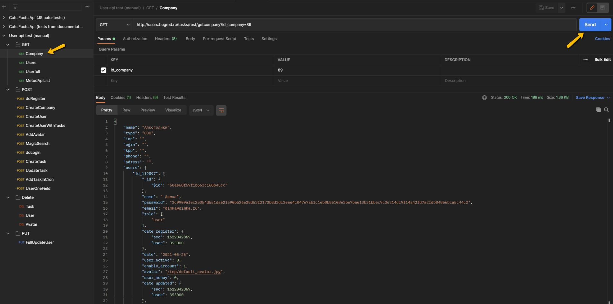
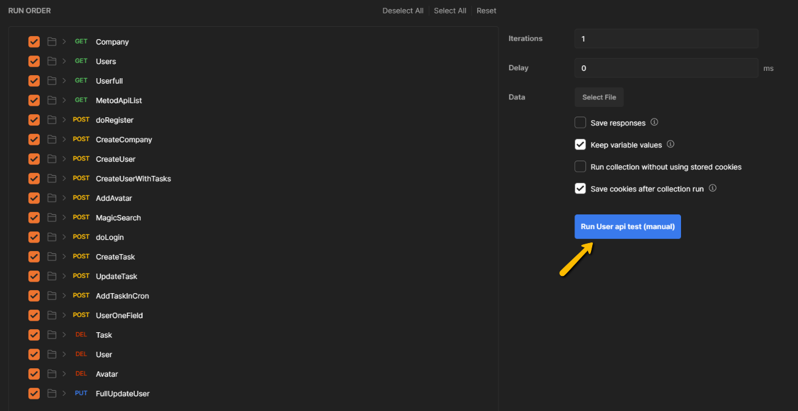

 # `Postman collection` по тестированию API [users.bugred.ru](http://users.bugred.ru/)
Автотесты реализованы при помощи среды **`Postman`**

 ## Описание

 Реализация функционального тестирования API [users.bugred.ru](http://users.bugred.ru/) в среде `Postman`, с использованием следующего набора тестов:

**Коллекция `User api test (manual)`** содержит следующие тестовые запросы, согласно [документации](https://testbase.atlassian.net/wiki/spaces/USERS/overview?homepageId=1074221):

* **`GET` запросы**
    * *`Company`* - получение информации о компании по ключу `id_company`
    * *`Users`* - получение информации о пользователе по ключу `email`
    * *`Userfull`* - получение полной информации о пользователе по ключу `email` (включая информацию о заданиях и компаниях)
    * *`MetodApiList`* - получение списка всех методов работы с API в формате `json`

* **`POST` запросы**
    * *`doRegister`* - регистрация нового пользователя в системе
    * *`CreateCompany`* - создание новой компании
    * *`CreateUser`* - создание нового пользователя
    * *`CreateUserWithTasks`* - создание нового пользователя с привязкой к задаче
    * *`AddAvatar`* - загрузка аватара пользователя *(в качестве тестовой картинки используйте изображение из папки `image`)*
    * *`MagicSearch`* - поиск по сотрудникам или компаниям 
    * *`doLogin`* - вход в систему под зарегестрированным пользователем
    * *`CreateTask`* - создание задачи пользователю
    * *`UpdateTask`* - обновление задачи пользователю
    * *`AddTaskInCron`* - создание запуска задачи по расписанию
    * *`UserOneField`* - изменение данных одного поля пользователя

* **`DELETE` запросы**
    * *`Task`* - удаление задачи пользователя
    * *`Users`* - удаление пользователя
    * *`Avatar`* - удаление аватара пользователя

* **`PUT` запросы**
    * *`FullUpdateUser`* - обновление всей информации о пользователе

## Запуск и использование

Для использования коллекции необходимо установить [`Postman`](https://www.postman.com/downloads/) и далее импортировать коллекции:

**Запустить определенный тест:**

*Пример запуска `GET` запроса `Company`:*

**Запустить все тесты:**

*Пример запуска всей коллекции тестов `User api test (manual)`:*

